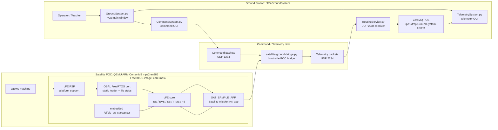

# cFS Satellite System FreeRTOS POC

This workspace is a proof of concept for running cFS/cFE on FreeRTOS instead of the current Ubuntu ARM64 satellite VM.

All commands below are run from the repository root, regardless of where the repository was cloned.

## What Works

- Source workspace: repository root, independent of clone location
- Base repo: `https://github.com/pztrick/cfs-freertos`
- Target: QEMU `mps2-an385` ARM Cortex-M3
- RTOS: FreeRTOS
- cFS components: cFE, OSAL, PSP
- Build output: `build-mps2/cortex-m3/default_mps2/mps2/core-mps2`
- Startup script: embedded `/cf/cfe_es_startup.scr`
- Mission app: static `satellite-sample` app loaded as `SAT_SAMPLE_APP`
- Mission behavior: emits Satellite Mission HK state, mode, status, uptime, payload, and battery telemetry
- Ground bridge: forwards telemetry to `cFS-GroundSystem` on UDP `2234` and receives commands on UDP `1234`
- Smoke test: cFE boots, starts the mission app, reaches `OPERATIONAL state`, and sends GroundSystem telemetry

## Build

```bash
./build-satellite-freertos-poc.sh
```

## Run

```bash
./start-satellite-freertos-poc.sh
```

This starts QEMU through `satellite-ground-bridge.py` by default.

To run QEMU without the GroundSystem bridge:

```bash
SATELLITE_BRIDGE=0 ./start-satellite-freertos-poc.sh
```

In bridge mode, stop the satellite with:

```text
Ctrl-C
```

In direct QEMU mode, exit QEMU with:

```text
Ctrl-a x
```

## Ground Station

Start the ground station in another terminal:

```bash
./start-ground-system.sh
```

Telemetry path:

- `SAT_SAMPLE_APP` prints `SAT_MISSION_HK,...` records in QEMU.
- `satellite-ground-bridge.py` converts those records into CCSDS-style UDP telemetry packet `0x883`.
- `RoutingService.py` receives UDP telemetry on port `2234`.
- The Telemetry System can open `Satellite Mission HK`.

Command path:

- The GroundSystem command GUI sends UDP commands to `127.0.0.1:1234`.
- The bridge accepts packet `0x1882` command codes `0`, `1`, and `2`.
- The bridge returns command ACK state in the next `0x883` telemetry packet.

## Architecture



Current POC status:

- Solid lines are implemented for the POC bridge path.
- Ground telemetry routing receives Satellite Mission HK on UDP port `2234`.
- Ground command tooling sends Sample/Satellite Mission commands on UDP port `1234`.
- Native FreeRTOS socket-based CI/TO inside the flight image is not implemented yet.

## Mission App POC

The FreeRTOS filesystem port is still experimental, so this POC embeds the startup script into the image and exposes it at `/cf/cfe_es_startup.scr`.

Startup script entry:

```text
CFE_APP, /cf/satellite_sample.so, SatSample_AppMain, SAT_SAMPLE_APP, 5, 16384, 0x0, 0;
```

Important FreeRTOS/cFE constraints found during the POC:

- `OS_MAX_API_NAME` is 20, so app names and entry point names must stay under that limit.
- `configMAX_PRIORITIES` is 10, so the startup priority uses `5` instead of the Linux-style cFE sample priority `100`.
- The FreeRTOS loader stub needed static-module lookup support so cFE can load statically linked apps.
- The FreeRTOS OSAL socket layer is still stubbed, so GroundSystem integration currently uses a host-side bridge.

Verified QEMU smoke test:

```text
ES Startup: Opened ES App Startup file: /cf/cfe_es_startup.scr
ES Startup: Loading file: /cf/satellite_sample.so, APP: SAT_SAMPLE_APP
SatSample_AppMain entered
SatelliteSample registered with cFE
SAT_SAMPLE_APP 1: Satellite mission app started on FreeRTOS
SAT_SAMPLE_APP 2: Satellite mission mode changed to 1
SAT_MISSION_HK,1,0,0,1,0,1,0,97
[bridge] UDP telemetry -> 127.0.0.1:2234 seq=1 cmd=0 err=0 mode=1 status=0 reason=flight-hk
ES Startup: CFE_ES_Main entering OPERATIONAL state
SAT_MISSION_HK,4,0,0,2,0,4,1,98
[bridge] UDP command <- 127.0.0.1:41968 pkt=0x1882 cc=0 accepted
[bridge] UDP telemetry -> 127.0.0.1:2234 seq=18 cmd=1 err=0 mode=2 status=0 reason=command-accepted
```

## Current Limitation

This is now more than a core boot POC, but it is still not a full replacement for the Ubuntu satellite VM. Telemetry reaches `cFS-GroundSystem`, and commands are received by the host bridge, but command packets are not yet injected into cFE Software Bus inside the FreeRTOS image. That requires implementing either OSAL sockets/CI_LAB/TO_LAB for this target or a UART RX command ingest path.

## Next Milestones

1. Implement native FreeRTOS command ingest into cFE Software Bus.
2. Replace the host bridge telemetry path with native TO_LAB-style UDP telemetry if the target gets socket support.
3. Decide whether to keep the embedded `/cf` startup script or implement more of the filesystem.
4. Add richer mission commands and packet definitions after command ingest is native.
