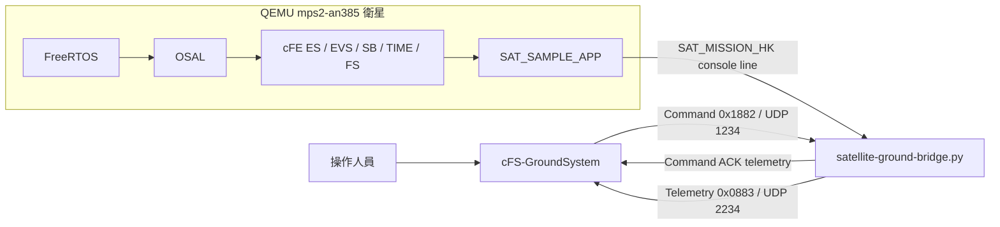

# cFS 衛星系統交接手冊

最後驗證日期：2026-08-05

主要工作環境：WSL2、Ubuntu 24.04、x86_64 host

本文件提供新接手者從零建立並操作以下三個部分所需的資訊：

1. `cFS-GroundSystem` 地面站。
2. FreeRTOS + cFE + mission app 衛星 POC。
3. 舊版 Ubuntu ARM64 cFS 衛星虛擬機。

目前研究主線是 **FreeRTOS 衛星 POC**。Ubuntu ARM64 虛擬機保留作為功能比較、網路通訊參考與回退環境。

## 0. 目前機器五分鐘啟動

Terminal 1 啟動地面站：

```bash
cd ~/cfs-satellite-system/tools/cFS-GroundSystem
make -C Subsystems/cmdUtil
python3 GroundSystem.py
```

Terminal 2 啟動 FreeRTOS 衛星：

```bash
cd ~/cfs-satellite-system
./start-satellite-freertos-poc.sh
```

看到 `CFE_ES_Main entering OPERATIONAL state` 與持續出現的 `SAT_MISSION_HK`，表示衛星端已啟動。回到 GroundSystem，等主視窗偵測到 `127.0.0.1`，選取該 spacecraft 後開啟 Telemetry System，查看 `Satellite Mission HK`；Command System 則可發送 `Satellite Mission` 的 `Mission No-Op`。

## 1. 目前完成程度

| 項目 | 狀態 | 說明 |
| --- | --- | --- |
| FreeRTOS 在 QEMU 啟動 | 完成 | 使用 `mps2-an385`、ARM Cortex-M3 |
| cFE core 啟動 | 完成 | 可進入 `OPERATIONAL state` |
| mission app | 完成 POC | `SAT_SAMPLE_APP` 會產生模式、電池及 payload telemetry |
| `/cf` startup script | 完成 POC | startup script 以 embedded file 方式放進映像 |
| 地面站 telemetry | 完成 POC | bridge 將 console telemetry 轉成 UDP `0x0883` |
| 地面站 command | 完成 bridge 測試 | UDP `0x1882` 可被 bridge 接收並回報 ACK |
| FreeRTOS 原生 UDP | 未完成 | OSAL socket implementation 仍是 stub |
| command 進入 cFE Software Bus | 未完成 | command 目前停在 host bridge |
| FreeRTOS 原生 CI_LAB/TO_LAB | 未完成 | 需先完成 OSAL socket 或改用 UART ingest |

## 2. 系統架構



重要觀念：目前 bridge 是 host 端 Python 程式。它不是 FreeRTOS flight image 內的 CI_LAB 或 TO_LAB。

## 3. 專案位置

| 用途 | 目前位置 |
| --- | --- |
| FreeRTOS 衛星 POC | `~/cfs-satellite-system` |
| FreeRTOS flight image | `~/cfs-satellite-system/build-mps2/cortex-m3/default_mps2/mps2/core-mps2` |
| 地面站 | `~/cfs-satellite-system/tools/cFS-GroundSystem` |
| Ubuntu ARM64 VM | `~/cfs-satellite-system/vm/ubuntu-arm64` |
| Ubuntu VM 內的 cFS | `/home/johnson/nasa/cFS` |

## 4. Monorepo Git 狀態

截至 2026-08-05，FreeRTOS flight software、OSAL patch、GroundSystem、VM scripts 與文件已整合到單一 repository：

```text
~/cfs-satellite-system
```

原本的 submodules 已轉成普通追蹤目錄。新接手者只需要 clone 這一個 repository，不需要另外取得本機的 OSAL 或 GroundSystem branches，也不需要執行 `git submodule update`。各上游元件的 URL、版本與 SHA 記錄在 `THIRD_PARTY_SOURCES.md`。

整合成果包括：

- `apps/satellite-sample/`
- `build-satellite-freertos-poc.sh`
- `start-satellite-freertos-poc.sh`
- `satellite-ground-bridge.py`
- `SATELLITE-FREERTOS-POC.md`
- `apps/freertos-fatfs/src/os-impl-filesys.c` 修改
- `mps2_defs/targets.cmake` 修改
- `mps2_defs/mps2_cfe_es_startup.scr` 修改
- `osal/src/os/freertos/todo/os-impl-module.c` static loader 修改

GroundSystem repository 的本地成果包括：

- `Subsystems/tlmGUI/satellite-mission-hk-tlm.txt`
- `Subsystems/tlmGUI/telemetry-pages.txt` 修改
- `Subsystems/cmdGui/command-pages.txt` 修改
- `Subsystems/cmdGui/quick-buttons.txt` 修改

正式交接前只剩兩個 Git 工作：

1. 為 monorepo 設定一個新 remote 並推送 `main`。
2. 在另一個空目錄 clone 該 remote，執行完整驗收清單。

## 5. Host 環境建立

以下命令以 Ubuntu 24.04 或 WSL2 Ubuntu 24.04 為例：

```bash
sudo apt update
sudo apt install -y \
    build-essential \
    cmake \
    git \
    make \
    wget \
    qemu-system-arm \
    qemu-efi-aarch64 \
    qemu-utils \
    cloud-image-utils \
    python3 \
    python3-pyqt5 \
    python3-zmq \
    libcanberra-gtk-module
```

確認工具：

```bash
qemu-system-arm --version
qemu-system-aarch64 --version
cloud-localds --help | head
python3 --version
git --version
```

若使用 WSL2，PyQt GUI 需要 WSLg 或可用的 X server。可先確認：

```bash
echo "$DISPLAY"
```

## 6. 建立與啟動地面站

### 6.1 使用目前交接工作區

```bash
cd ~/cfs-satellite-system/tools/cFS-GroundSystem
make -C Subsystems/cmdUtil
python3 GroundSystem.py
```

主視窗必須保持開啟，因為 `RoutingService.py` 會：

- 在 UDP `2234` 接收 telemetry。
- 發布到 ZeroMQ `ipc:///tmp/GroundSystem-<使用者名稱>`。
- 供 Telemetry System 訂閱封包。

### 6.2 Monorepo 內建地面站

```bash
cd ~/cfs-satellite-system/tools/cFS-GroundSystem
make -C Subsystems/cmdUtil
python3 GroundSystem.py
```

此目錄已包含 `Satellite Mission` 與 `Satellite Mission HK` 設定，不需要再 clone NASA GroundSystem 或手動複製 packet definition。

### 6.3 FreeRTOS POC 的地面站操作

1. 啟動 `GroundSystem.py`。
2. 啟動 FreeRTOS 衛星並等待主視窗偵測到 `127.0.0.1`。
3. 在主視窗選取該 spacecraft，再點選 `Start Telemetry System`。
4. 在 telemetry 清單開啟 `Satellite Mission HK`。
5. 點選 `Start Command System`。
6. 在 Command System 選擇 `Satellite Mission`。
7. 發送 `Mission No-Op`。

目前 bridge 使用的 packet 定義：

| 方向 | Packet ID | UDP port | 說明 |
| --- | --- | --- | --- |
| Ground -> bridge | `0x1882` | `1234` | Satellite Mission command |
| Bridge -> Ground | `0x0883` | `2234` | Satellite Mission HK telemetry |

Command code：

| Code | 目前 bridge 行為 |
| --- | --- |
| `0` | No-Op，command counter 加一 |
| `1` | 重設 bridge command/error counter |
| `2` | bridge payload sample counter 加一 |

注意：以上 command 行為目前由 bridge 執行，尚未送入 FreeRTOS mission app。

Telemetry payload layout：

| 欄位 | Packet offset | 型別 |
| --- | ---: | --- |
| Command Counter | 12 | `uint8` |
| Error Counter | 13 | `uint8` |
| Mission Mode | 14 | `uint8` |
| Mission Status | 15 | `uint8` |
| Uptime Seconds | 16 | little-endian `uint32` |
| Payload Samples | 20 | little-endian `uint32` |
| Battery Percent | 24 | little-endian `uint16` |

## 7. 建立 FreeRTOS 衛星程式

### 7.1 取得原始碼

從交接 remote clone monorepo：

```bash
git clone <MONOREPO_URL> cfs-satellite-system
cd cfs-satellite-system
```

所有必要原始碼已包含在 repository 內，不需要另外初始化 submodules。`<MONOREPO_URL>` 應在正式推送後替換成學校或團隊的 Git URL。

### 7.2 安裝 ARM bare-metal toolchain

建置腳本預期以下固定位置：

```text
~/cfs-satellite-system/toolchain/gcc-arm-none-eabi-9-2019-q4-major/bin/arm-none-eabi-gcc
```

建立方式：

```bash
cd ~/cfs-satellite-system
mkdir -p toolchain
wget -O /tmp/gcc-arm-none-eabi-9-2019-q4-major.tar.bz2 \
    https://developer.arm.com/-/media/Files/downloads/gnu-rm/9-2019q4/gcc-arm-none-eabi-9-2019-q4-major-x86_64-linux.tar.bz2
tar -xjf /tmp/gcc-arm-none-eabi-9-2019-q4-major.tar.bz2 -C toolchain
```

確認：

```bash
./toolchain/gcc-arm-none-eabi-9-2019-q4-major/bin/arm-none-eabi-gcc --version
```

若舊版 Arm 下載網址失效，最穩定的交接方式是一起保留目前的 `toolchain/gcc-arm-none-eabi-9-2019-q4-major` 目錄，或修改 build script 使用已驗證的新 toolchain。

### 7.3 建置 flight image

```bash
cd ~/cfs-satellite-system
./build-satellite-freertos-poc.sh
```

輸出應為：

```text
build-mps2/cortex-m3/default_mps2/mps2/core-mps2
```

確認映像：

```bash
file build-mps2/cortex-m3/default_mps2/mps2/core-mps2
```

應看到 32-bit ARM、statically linked ELF。

### 7.4 一鍵啟動 FreeRTOS 衛星與 bridge

```bash
cd ~/cfs-satellite-system
./start-satellite-freertos-poc.sh
```

預設行為：

- 啟動 QEMU `mps2-an385`。
- 載入 `core-mps2`。
- 啟動 `satellite-ground-bridge.py`。
- 在 `127.0.0.1:1234` 接收 GroundSystem command。
- 將 telemetry 傳到 `127.0.0.1:2234`。

只啟動 QEMU、不啟動 bridge：

```bash
SATELLITE_BRIDGE=0 ./start-satellite-freertos-poc.sh
```

停止方式：

- bridge mode：`Ctrl-C`
- direct QEMU mode：`Ctrl-a`，再按 `x`

### 7.5 成功啟動的判斷方式

至少應看到：

```text
ES Startup: Opened ES App Startup file: /cf/cfe_es_startup.scr
ES Startup: Loading file: /cf/satellite_sample.so, APP: SAT_SAMPLE_APP
Satellite mission app started on FreeRTOS
CFE_ES_Main entering OPERATIONAL state
SAT_MISSION_HK,...
[bridge] UDP telemetry -> 127.0.0.1:2234
```

發送 GroundSystem No-Op 後應看到：

```text
[bridge] UDP command <- 127.0.0.1:<port> pkt=0x1882 cc=0 accepted
[bridge] UDP telemetry -> 127.0.0.1:2234 ... reason=command-accepted
```

## 8. FreeRTOS mission app 如何組成

| 檔案 | 用途 |
| --- | --- |
| `apps/satellite-sample/fsw/src/satellite_sample_app.c` | mission state machine 與 console telemetry |
| `apps/satellite-sample/CMakeLists.txt` | 將 app 加入 cFE build |
| `mps2_defs/targets.cmake` | 靜態連結 app 並建立 symbol table |
| `mps2_defs/mps2_cfe_es_startup.scr` | cFE startup entry |
| `apps/freertos-fatfs/src/os-impl-filesys.c` | 讓 cFE 可讀 embedded startup script |
| `osal/src/os/freertos/todo/os-impl-module.c` | static module/symbol lookup |
| `satellite-ground-bridge.py` | console 與 GroundSystem UDP 之間的 POC bridge |

Mission app 狀態：

- 啟動後進入 `SAFE`。
- 約第 4 秒進入 `NOMINAL`。
- `NOMINAL` 狀態會累加 payload samples 並消耗模擬電池。
- 電量低於 30 時狀態變成 `LOW_BATTERY`。
- 每秒輸出一行 `SAT_MISSION_HK`。

FreeRTOS/cFE 目前已知限制：

- `OS_MAX_API_NAME` 是 20，app 與 entry point 名稱不可過長。
- `configMAX_PRIORITIES` 是 10，startup script 使用 priority `5`。
- cFE dynamic loader 不可用，目前 app 是 static linked。
- `/cf` 不是完整 filesystem，目前只特別支援 embedded startup script。
- OSAL socket functions 回傳 `OS_ERR_NOT_IMPLEMENTED`。
- QEMU cFE 時間尚未正確初始化。
- 啟動可看到 CDS 大小不足訊息：目前配置 `8192`，需求約 `38932`。

## 9. 使用 Ubuntu ARM64 衛星虛擬機

目前 VM 資訊：

| 項目 | 值 |
| --- | --- |
| 目錄 | `~/cfs-satellite-system/vm/ubuntu-arm64` |
| Guest OS | Ubuntu 24.04 ARM64 |
| Machine | QEMU `virt` |
| CPU | Cortex-A72，4 cores |
| RAM | 4096 MB |
| Disk | `ubuntu-arm64.img`，20 GiB virtual qcow2 |
| SSH | host `127.0.0.1:2222` -> guest `22` |
| cFS command | host UDP `1234` -> guest UDP `1234` |
| Guest 帳號 | `cfs`，可用 `VM_USER` 覆寫 |
| Guest cFS | `/home/cfs/nasa/cFS` |

第一次使用先建立 image 與 cloud-init seed：

```bash
cd ~/cfs-satellite-system/vm/ubuntu-arm64
./create-vm.sh
```

啟動：

```bash
cd ~/cfs-satellite-system/vm/ubuntu-arm64
./start-satellite-system.sh
```

首次開機可能需要約 1 至 2 分鐘。另一個 terminal 登入：

```bash
ssh -p 2222 cfs@127.0.0.1
```

在 guest 裡啟動 Ubuntu 版本 cFS：

```bash
cd ~/nasa/cFS/build/exe/cpu1
./core-cpu1
```

應看到：

```text
CFE_ES_Main entering OPERATIONAL state
```

停止 cFS 使用 `Ctrl-C`。關閉 VM 建議在 guest 執行：

```bash
sudo poweroff
```

若只想立即離開 QEMU console，可按 `Ctrl-a`，再按 `x`，但這相當於直接關機。

## 10. 從零建立 Ubuntu ARM64 QEMU VM

以下步驟會建立一台新的 Ubuntu ARM64 cloud-image VM。

建議直接使用 monorepo 腳本，它會完成第 10.1 至 10.3 節：

```bash
cd ~/cfs-satellite-system/vm/ubuntu-arm64
./create-vm.sh
```

以下保留手動流程供除錯與修改環境時參考。

### 10.1 建立目錄並下載映像

```bash
mkdir -p ~/cfs-satellite-system/vm/ubuntu-arm64
cd ~/cfs-satellite-system/vm/ubuntu-arm64
wget https://cloud-images.ubuntu.com/noble/current/noble-server-cloudimg-arm64.img
cp noble-server-cloudimg-arm64.img ubuntu-arm64.img
qemu-img resize ubuntu-arm64.img 20G
```

### 10.2 建立 SSH key

如果 host 尚無 SSH key：

```bash
ssh-keygen -t ed25519
```

查看 public key：

```bash
ssh-keygen -y -f ~/.ssh/id_ed25519
```

將輸出的整行文字填入下一節的 `<SSH_PUBLIC_KEY>`，不要放 private key。

### 10.3 建立 cloud-init 設定

建立 `user-data`：

```yaml
#cloud-config
users:
  - name: cfs
    groups: sudo
    shell: /bin/bash
    sudo: ALL=(ALL) NOPASSWD:ALL
    ssh_authorized_keys:
      - <SSH_PUBLIC_KEY>
package_update: true
packages:
  - build-essential
  - git
  - cmake
  - ninja-build
  - python3
  - python3-pip
  - net-tools
  - openssh-server
```

建立 `meta-data`：

```yaml
instance-id: qemu-arm64-cfs
local-hostname: qemu-arm64
```

產生 seed image：

```bash
cloud-localds seed.img user-data meta-data
```

修改 `user-data` 後必須重新執行 `cloud-localds`。已經初始化過的 VM 若要重新套用 cloud-init，建議建立新的 `ubuntu-arm64.img`，避免 instance-id cache 造成設定不更新。

### 10.4 啟動新 VM

可使用目前的 `start-satellite-system.sh`，或直接執行：

```bash
qemu-system-aarch64 \
    -machine virt \
    -cpu cortex-a72 \
    -smp 4 \
    -m 4096 \
    -bios /usr/share/AAVMF/AAVMF_CODE.fd \
    -drive if=virtio,format=qcow2,file=ubuntu-arm64.img \
    -drive if=virtio,format=raw,file=seed.img \
    -netdev user,id=net0,hostfwd=tcp::2222-:22,hostfwd=udp::1234-:1234 \
    -device virtio-net-pci,netdev=net0 \
    -nographic
```

另一個 terminal 登入：

```bash
ssh -p 2222 cfs@127.0.0.1
```

### 10.5 在 ARM64 VM 內建立 NASA cFS

以下命令都在 guest VM 內執行：

```bash
mkdir -p ~/nasa
cd ~/nasa
git clone https://github.com/nasa/cFS.git
cd cFS
git submodule update --init --recursive
cp cfe/cmake/Makefile.sample Makefile
cp -r cfe/cmake/sample_defs sample_defs
make SIMULATION=native prep
make -j"$(nproc)"
make install
```

啟動：

```bash
cd ~/nasa/cFS/build/exe/cpu1
./core-cpu1
```

若要固定成與交接時相同的版本，應在交接完成 Git commit 後記錄 SHA，並在 clone 後執行：

```bash
git checkout <已驗證的-cFS-commit>
git submodule update --init --recursive
```

## 11. Ubuntu VM 與地面站連線方式

QEMU user-mode networking 中：

- Host 傳 command：送到 `127.0.0.1:1234`，QEMU 轉送到 guest `1234`。
- Guest 傳 telemetry 到 host：目的 IP 使用 `10.0.2.2`，port 使用 `2234`。

建議啟動順序：

1. Host 執行 `~/cfs-satellite-system/vm/ubuntu-arm64/start-satellite-system.sh`。
2. SSH 進 guest。
3. Guest 在 `~/nasa/cFS/build/exe/cpu1` 執行 `./core-cpu1`。
4. Host 執行 `~/cfs-satellite-system/tools/cFS-GroundSystem/GroundSystem.py`。
5. 開啟 Command System。
6. 發送 `Enable Tlm`，telemetry destination 輸入 `10.0.2.2`。
7. 開啟 Telemetry System。

不要把 Ubuntu VM 的 telemetry destination 設成 guest 的 `127.0.0.1`，否則 telemetry 只會留在 VM 裡。

## 12. 快速驗收清單

### FreeRTOS POC

- [ ] `./build-satellite-freertos-poc.sh` 成功。
- [ ] `core-mps2` 是 ARM ELF。
- [ ] QEMU 顯示 cFE `OPERATIONAL state`。
- [ ] `SAT_SAMPLE_APP` 成功啟動。
- [ ] console 每秒出現 `SAT_MISSION_HK`。
- [ ] bridge 顯示 UDP telemetry 傳到 `2234`。
- [ ] GroundSystem 可開啟 `Satellite Mission HK`。
- [ ] `Mission No-Op` 顯示 command accepted。

### Ubuntu ARM64 VM

- [ ] QEMU 可完成 Ubuntu 開機。
- [ ] `ssh -p 2222 johnson@127.0.0.1` 可登入。
- [ ] guest 的 `core-cpu1` 可進入 `OPERATIONAL state`。
- [ ] command 可由 host UDP `1234` 送進 guest。
- [ ] TO_LAB destination 設為 `10.0.2.2:2234` 後，地面站收到 telemetry。

## 13. 常見問題

### `arm-none-eabi-gcc` 找不到

確認 toolchain 是否位於 build script 預期位置：

```bash
ls -l ~/cfs-satellite-system/toolchain/gcc-arm-none-eabi-9-2019-q4-major/bin/arm-none-eabi-gcc
```

### `qemu-system-arm` 或 `qemu-system-aarch64` 找不到

```bash
sudo apt install qemu-system-arm
```

### 找不到 `/usr/share/AAVMF/AAVMF_CODE.fd`

```bash
sudo apt install qemu-efi-aarch64
```

### UDP port 已被占用

```bash
ss -lunp | grep -E ':(1234|2234)\b'
```

停止舊的 GroundSystem、bridge、cFS 或 QEMU 後再啟動。不要同時啟動 FreeRTOS bridge 與 Ubuntu VM cFS command path，兩者預設都使用 UDP `1234`。

### GroundSystem 沒有畫面

在 WSL2 確認 WSLg 與 `DISPLAY`：

```bash
echo "$DISPLAY"
python3 -c "from PyQt5.QtWidgets import QApplication; print('PyQt5 OK')"
```

### FreeRTOS 有 telemetry，但 mission app 收不到 command

這是目前架構限制，不是操作錯誤。bridge 只解析 host 端 command，尚未將 packet 注入 cFE Software Bus。

### Ubuntu VM 收不到 telemetry

確認 TO_LAB destination 是 `10.0.2.2`，GroundSystem 正在 host 的 UDP `2234` 監聽。

### WSL 無法啟動

先在 Windows PowerShell 執行：

```powershell
wsl --shutdown
wsl --status
wsl --update
```

再重新開啟 WSL。若仍失敗，重新啟動 Windows 的 WSL service 或主機。

## 14. 下一位接手者的優先工作

1. 將 monorepo `main` 推送到可交接的 remote，並在乾淨目錄測試 clone。
2. 選擇 FreeRTOS 網路方案：FreeRTOS+TCP、其他可用 IP stack，或 UART command ingest。
3. 將 GroundSystem command 真正送入 cFE Software Bus。
4. 將 mission app 改為訂閱 command MID，而非由 host bridge 模擬 command 行為。
5. 讓 telemetry 經 cFE Software Bus 與 TO app 輸出，而非解析 console line。
6. 調整 CDS 配置大小並修正 cFE/QEMU 時間來源。
7. 為 build、boot、command、telemetry 建立可重複的自動測試。

## 15. 其他文件與展示資料

- `SATELLITE-FREERTOS-POC.md`：POC 技術摘要與架構。
- `研究進度-cFS-FreeRTOS-POC-含逐字稿.pptx`：目前研究進度簡報與講稿。
- `研究進度-逐字稿.md`：簡報逐字稿純文字版本。
